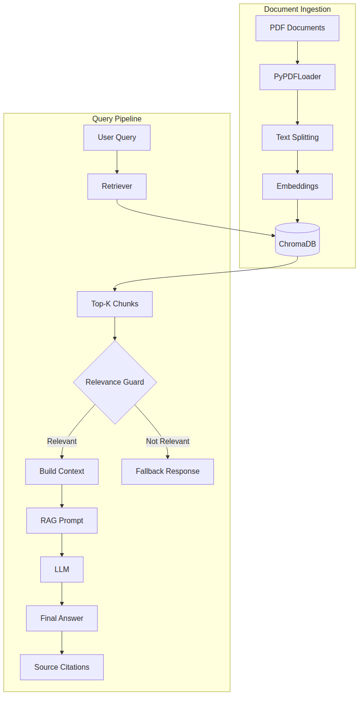
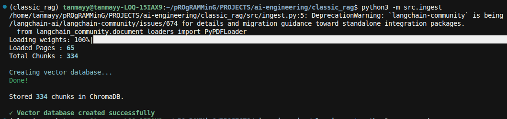
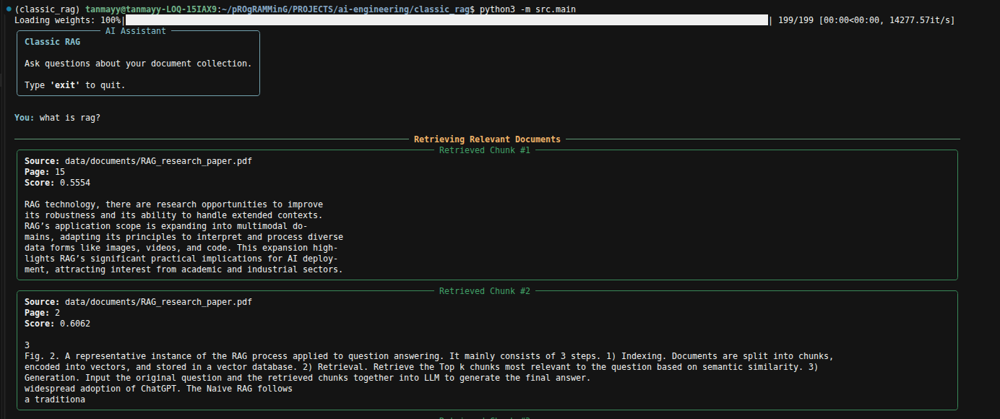
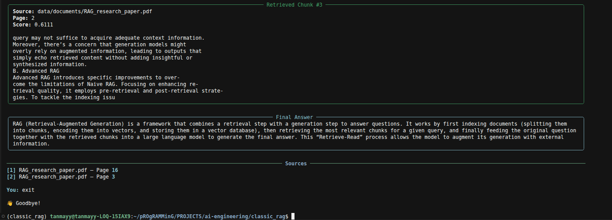
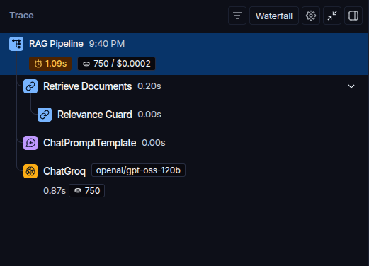

# Classic RAG

A Retrieval-Augmented Generation system for question answering over PDF documents. Drop your PDFs into the `data/documents/` directory, build the vector database, and ask questions — the system retrieves relevant context from your documents and generates grounded answers using an LLM.

The pipeline includes a **relevance guard** that filters out low-relevance chunks before they reach the LLM. If no retrieved context passes the relevance threshold, the LLM is never called — the system returns a fallback response instead. This prevents hallucinated answers when the documents don't contain relevant information.

## ✨ Features

- **PDF Document Ingestion** — Load and process PDF files using `PyPDFLoader` with automatic page extraction.
- **Recursive Text Chunking** — Split documents into overlapping chunks using `RecursiveCharacterTextSplitter` with configurable chunk size and overlap.
- **HuggingFace Embeddings** — Generate dense vector representations using `BAAI/bge-small-en-v1.5` via `HuggingFaceEmbeddings`.
- **ChromaDB Vector Storage** — Persist embeddings in a local ChromaDB instance for fast similarity search.
- **Similarity-Based Retrieval** — Retrieve the top-K most relevant chunks for any user query using cosine similarity.
- **Relevance / Hallucination Guard** — Filter retrieved chunks against a configurable relevance threshold. If nothing is relevant, the LLM call is skipped entirely.
- **LLM-Based Answer Generation** — Generate answers grounded in retrieved context using `ChatGroq`.
- **Source Citations** — Display source file names and page numbers alongside every answer.
- **Rich CLI Interface** — Clean terminal experience with styled panels, rules, and color-coded output using `Rich`.
- **LangSmith Tracing** — Automatic observability for the RAG pipeline, retrieval, relevance guard, prompt construction, and LLM calls.

## 🏗️ How It Works

The system operates in two phases: **document ingestion** (offline, run once) and **query-time retrieval + generation** (interactive, per question).

```
PDF Documents
    ↓
PDF Loading (PyPDFLoader)
    ↓
Text Chunking (RecursiveCharacterTextSplitter)
    ↓
Embeddings (HuggingFace bge-small-en-v1.5)
    ↓
ChromaDB (vector store)
    ↓
User Query
    ↓
Similarity Search (Top-K retrieval)
    ↓
Relevance Guard (threshold filtering)
    ↓
Relevant context found?
   /              \
 Yes               No
  ↓                 ↓
RAG Prompt     Fallback Response
  ↓            ("I couldn't find the answer
LLM             in the provided documents.")
  ↓
Final Answer
  ↓
Source Citations
```

**Phase 1 — Document Ingestion:**

1. PDF files are loaded from `data/documents/` using `PyPDFLoader`.
2. Each document is split into chunks using `RecursiveCharacterTextSplitter` (default: 1000 chars with 200 char overlap).
3. Chunks are embedded using the `BAAI/bge-small-en-v1.5` model.
4. Embeddings are stored in a local ChromaDB instance at `chroma_db/`.
5. The ingestion script always rebuilds from scratch — it deletes the existing vector database before creating a new one.

**Phase 2 — Query Pipeline:**

1. The user enters a question through the CLI.
2. The question is embedded and used to retrieve the top-K most similar chunks from ChromaDB (default: K=3).
3. Retrieved chunks pass through the **relevance guard**, which filters out chunks whose similarity score exceeds the threshold (default: 0.8).
4. If relevant chunks remain, they are assembled into a context block, injected into the RAG prompt, and sent to the LLM.
5. If no relevant chunks remain, the LLM is **not called** — a fallback response is returned directly.
6. The final answer is displayed along with source file names and page numbers.

## 📐 Architecture



The architecture diagram shows the two core subgraphs:

**Document Ingestion** — the offline path where PDFs are loaded, split, embedded, and stored in ChromaDB. This runs once (or whenever your document set changes).

**Query Pipeline** — the runtime path where user queries flow through the retriever, relevance guard, and (conditionally) the LLM. The relevance guard is the decision point: it determines whether the retrieved chunks are worth sending to the LLM or if the system should short-circuit with a fallback response.

> **Note:** LangSmith is not shown in the architecture diagram because it is an observability layer — it traces the pipeline execution but is not part of the data flow itself.

## 🛠️ Tech Stack

| Component | Technology |
|---|---|
| Language | Python 3.13 |
| LLM Framework | LangChain |
| LLM Provider | Groq (`ChatGroq` — `openai/gpt-oss-120b`) |
| Embeddings | HuggingFace (`BAAI/bge-small-en-v1.5`) |
| Vector Store | ChromaDB (`langchain-chroma`) |
| PDF Loading | `PyPDFLoader` (`langchain-community`) |
| Text Splitting | `RecursiveCharacterTextSplitter` (`langchain`) |
| Prompt Management | `ChatPromptTemplate` (`langchain-core`) |
| Observability | LangSmith |
| CLI Interface | Rich |
| Package Manager | uv |

## 📁 Project Structure

```
classic-rag/
│
├── data/
│   └── documents/           # Place your PDF files here
│       └── *.pdf
│
├── images/
│   ├── classic-rag-workflow.png   # Architecture diagram
│   ├── classic-rag-workflow.mmd   # Mermaid source for diagram
│   ├── cli-demo-ss1.png           # CLI demo screenshot
│   ├── cli-demo-ss2.png           # CLI demo screenshot
│   ├── cli-demo-ss3.png           # CLI demo screenshot
│   └── langsmith-trace.png        # LangSmith trace screenshot
│
├── scripts/
│   ├── generate_diagram.py        # Generates the architecture PNG from Mermaid
│   └── puppeteer-config.json      # Config for Mermaid CLI renderer
│
├── src/
│   ├── __init__.py
│   ├── chain.py             # RAG pipeline — retrieval, context assembly, LLM call
│   ├── config.py            # LLM, embeddings, and pipeline configuration
│   ├── ingest.py            # Document loading, chunking, and vector store creation
│   ├── main.py              # CLI entry point — interactive question loop
│   ├── prompts.py           # ChatPromptTemplate for RAG generation
│   ├── retriever.py         # Similarity search + relevance guard
│   └── utils.py             # Rich-based CLI rendering (banner, panels, sources)
│
├── .env.example             # Required environment variables template
├── .gitignore
├── pyproject.toml           # Project metadata and dependencies
├── uv.lock                  # Locked dependency versions
└── README.md
```

### Key Modules

- **`config.py`** — Central configuration. Initializes the `ChatGroq` LLM and `HuggingFaceEmbeddings`, and defines pipeline parameters (`CHUNK_SIZE`, `CHUNK_OVERLAP`, `TOP_K`, `RELEVANCE_THRESHOLD`, `CHROMA_DB_DIR`).
- **`ingest.py`** — Loads all PDFs from `data/documents/`, splits them into chunks, generates embeddings, and stores them in ChromaDB. Run as a standalone script.
- **`retriever.py`** — Performs `similarity_search_with_score` against ChromaDB and applies the relevance guard to filter results.
- **`chain.py`** — Orchestrates the RAG pipeline: calls the retriever, checks for relevant results, builds the prompt, and invokes the LLM. Traced as `"RAG Pipeline"` in LangSmith.
- **`prompts.py`** — Defines the `ChatPromptTemplate` that instructs the LLM to answer only from provided context.
- **`utils.py`** — Rich-powered terminal rendering: banner, chunk display, answer panels, source citations, and error messages.
- **`main.py`** — Interactive CLI loop. Handles user input, `exit` command, and `Ctrl+C` gracefully.

## 🚀 Getting Started

### Prerequisites

- Python 3.13+
- [uv](https://docs.astral.sh/uv/) installed (`curl -LsSf https://astral.sh/uv/install.sh | sh`)
- A [Groq](https://console.groq.com/) API key
- A [LangSmith](https://smith.langchain.com/) API key (for tracing)

### Setup

1. **Clone the repository**

```bash
git clone https://github.com/<your-username>/classic-rag.git
cd classic-rag
```

2. **Install dependencies with uv**

```bash
uv sync
```

This reads `pyproject.toml` and `uv.lock` to install exact dependency versions in an isolated virtual environment.

3. **Configure environment variables**

Copy the example and fill in your API keys:

```bash
cp .env.example .env
```

Edit `.env` with your actual keys:

```env
GROQ_API_KEY=your_groq_api_key
LANGSMITH_API_KEY=your_langsmith_api_key
LANGSMITH_TRACING=true
LANGSMITH_ENDPOINT=https://api.smith.langchain.com
LANGSMITH_PROJECT=classic-rag
```

4. **Add your PDF documents**

Place your PDF files in the `data/documents/` directory:

```bash
cp /path/to/your/documents/*.pdf data/documents/
```

5. **Build the vector database**

```bash
uv run python -m src.ingest
```

This loads your PDFs, splits them into chunks, generates embeddings, and stores everything in ChromaDB. The script rebuilds the database from scratch each time.

Example output:

```
Removing existing vector database...
Loaded Pages : 65
Total Chunks : 334

Creating vector database...
Done!

Stored 334 chunks in ChromaDB.

✓ Vector database created successfully
```

6. **Run the application**

```bash
uv run python -m src.main
```

## ⚙️ Environment Variables

All environment variables are defined in `.env.example`:

| Variable | Description | Required |
|---|---|---|
| `GROQ_API_KEY` | API key for Groq LLM provider | Yes |
| `LANGSMITH_API_KEY` | API key for LangSmith tracing | Yes |
| `LANGSMITH_TRACING` | Enable/disable LangSmith tracing (`true` / `false`) | Yes |
| `LANGSMITH_ENDPOINT` | LangSmith API endpoint | Yes |
| `LANGSMITH_PROJECT` | Project name in LangSmith dashboard | Yes |

## 💬 Usage

Start the application:

```bash
uv run python -m src.main
```

The CLI displays an introductory banner and waits for your questions:

```
╭──────────── AI Assistant ────────────╮
│ Classic RAG                          │
│                                      │
│ Ask questions about your document    │
│ collection.                          │
│                                      │
│ Type 'exit' to quit.                 │
╰──────────────────────────────────────╯
```

### Asking a Relevant Question

When the query matches content in your documents, the system retrieves relevant chunks, displays them with their source and score, and generates a grounded answer:

```
You: What are the key principles of transformer architecture?

──────── Retrieving Relevant Documents ────────

╭─────────── Retrieved Chunk #1 ───────────╮
│ Source: attention-is-all-you-need.pdf     │
│ Page: 3                                  │
│ Score: 0.4521                            │
│                                          │
│ The Transformer follows an encoder-      │
│ decoder structure using stacked self-     │
│ attention and...                         │
╰──────────────────────────────────────────╯

╭───────────── Final Answer ──────────────╮
│ The key principles of the transformer   │
│ architecture include self-attention      │
│ mechanisms, positional encoding...       │
╰─────────────────────────────────────────╯

──────────────── Sources ─────────────────
[1] attention-is-all-you-need.pdf — Page 4
[2] attention-is-all-you-need.pdf — Page 7
```

### Asking an Irrelevant Question

When the query doesn't match your documents, the relevance guard filters out all retrieved chunks and the LLM is never called:

```
You: What is the capital of France?

──────── Retrieving Relevant Documents ────────

╭───────────── Final Answer ──────────────╮
│ I couldn't find the answer in the       │
│ provided documents.                     │
╰─────────────────────────────────────────╯
```

### Exiting

Type `exit` to quit:

```
You: exit

👋 Goodbye!
```

Press `Ctrl+C` at any time for a clean exit:

```
^C

👋 Goodbye!
```

## 🖥️ CLI Demo

The Rich-powered CLI provides clear visual separation between retrieval results, answers, and source citations:







## 🛡️ Relevance / Hallucination Guard

The relevance guard is a critical component that prevents the LLM from generating answers when the retrieved context isn't relevant to the question.

### Why It Exists

Without this guard, the LLM would receive irrelevant chunks as context and might still produce a plausible-sounding but incorrect answer. By filtering retrieved chunks against a configurable similarity score threshold (`RELEVANCE_THRESHOLD = 0.8` by default), the system ensures that:

1. The LLM only receives context that is meaningfully related to the question.
2. If no chunk passes the threshold, the LLM is **never called** — saving latency and cost.
3. The user receives an honest "I couldn't find the answer" response instead of a hallucinated one.

### How It Works

The relevance guard is implemented in `retriever.py` as a separate traced function:

```python
@traceable(
    name="Relevance Guard",
    metadata={"relevance_threshold": RELEVANCE_THRESHOLD},
)
def apply_relevance_guard(results):
    return [
        (doc, score)
        for doc, score in results
        if score <= RELEVANCE_THRESHOLD
    ]
```

ChromaDB returns similarity scores where **lower is better** (distance-based). Chunks with a score ≤ the threshold are considered relevant; everything else is discarded.

### Execution Flow

```
Relevant Query:                    Irrelevant Query:

  Retrieve Top-K                     Retrieve Top-K
       ↓                                 ↓
  Relevance Guard                    Relevance Guard
  (chunks pass)                      (all filtered out)
       ↓                                 ↓
  Build Context                      Return Fallback
       ↓                             "I couldn't find..."
  RAG Prompt → LLM
       ↓
  Final Answer + Sources
```

## 🔍 Observability

LangSmith is integrated for tracing the RAG pipeline. When `LANGSMITH_TRACING=true`, every query is traced automatically through the `@traceable` decorator in `chain.py` and `retriever.py`.

### Trace Hierarchy

For a **relevant query** (LLM is called):

```
RAG Pipeline
├── Retrieve Documents
│   └── Relevance Guard
├── ChatPromptTemplate
└── ChatGroq
```

For an **irrelevant query** (LLM is skipped):

```
RAG Pipeline
└── Retrieve Documents
    └── Relevance Guard
```

When the relevance guard filters out all chunks, the trace stops after `Retrieve Documents` — there is no prompt construction or LLM call. This makes it easy to identify and debug irrelevant query handling in the LangSmith dashboard.



LangSmith is configured entirely through environment variables (`LANGSMITH_API_KEY`, `LANGSMITH_TRACING`, `LANGSMITH_ENDPOINT`, `LANGSMITH_PROJECT`). No additional code instrumentation is needed beyond the `@traceable` decorators.

## 📖 Key Concepts

This project demonstrates several core RAG concepts:

- **Retrieval-Augmented Generation (RAG)** — Grounding LLM responses in external knowledge by retrieving relevant documents before generation, rather than relying solely on the LLM's parametric knowledge.
- **Embeddings** — Converting text into dense vector representations that capture semantic meaning, enabling similarity-based search rather than keyword matching.
- **Vector Databases** — Storing and indexing embeddings (ChromaDB) for efficient nearest-neighbor retrieval at query time.
- **Similarity Search** — Finding the most relevant document chunks by comparing query embeddings against stored embeddings using distance metrics.
- **Text Chunking** — Breaking large documents into smaller, overlapping pieces so that each chunk fits within the LLM's context window and carries focused information.
- **Relevance Filtering** — Post-retrieval filtering to ensure only sufficiently relevant chunks reach the LLM, preventing hallucination on out-of-scope queries.
- **Grounded Generation** — Constraining the LLM to answer only from provided context, with explicit instructions to admit when the answer isn't available.

## 🔮 Future Improvements

- **Hybrid Search** — Combine dense vector search with sparse keyword search (BM25) for better retrieval across different query types.
- **Reranking** — Add a cross-encoder reranker to re-score retrieved chunks for higher precision before passing them to the LLM.
- **Metadata Filtering** — Filter retrieval by document source, page range, or custom tags for more targeted search.
- **Query Rewriting** — Transform user queries (e.g., HyDE, multi-query) to improve retrieval recall.
- **Evaluation Framework** — Build an evaluation pipeline to measure retrieval accuracy and answer quality on test datasets.
- **Streaming Responses** — Stream LLM output token-by-token for a more responsive user experience.
- **Conversation Memory** — Add multi-turn context so follow-up questions reference previous answers.
- **Advanced Observability** — Track retrieval quality metrics, relevance guard hit rates, and latency breakdowns over time.

## 📄 License

This repository does not currently include a license. If you plan to use or distribute this code, consider adding an appropriate open-source license (e.g., MIT, Apache 2.0).

---

Built with 📚 LangChain · ⚡ Groq · 🧠 HuggingFace · 🗄️ ChromaDB · 📊 LangSmith
